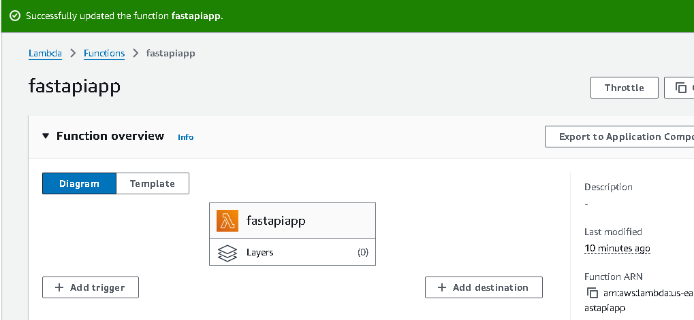

# Deploy FastAPI in AWS Lambda

### Commands
```console
  Run the below to create dependencies folder with files
  Need to bundle this with main.py
  > pip install -t dependencies -r requirements.txt

  >(cd dependencies; zip ../aws_lambda_artifacts.zip -r .)

  > zip aws_lambda_artifact.zip -u main.py

```


