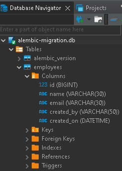
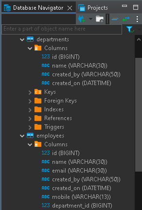
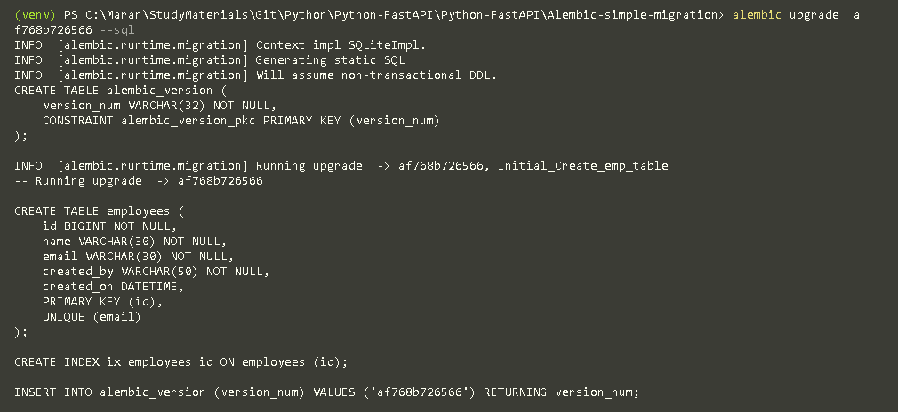
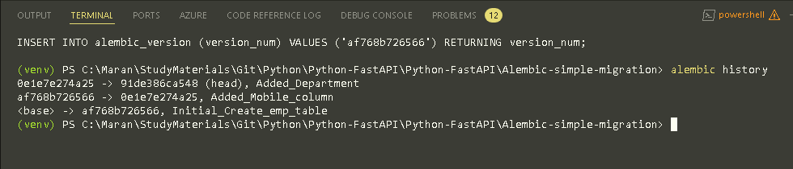

### Create the Alembic environment
```bash
# initialize the Alembic Migration
> alembic init <name>
#example here
> alembic init empapp

# create the initial revision wwith a meaningfull migration message
> alembic revision -m "Initial_create_emp_table"

# Apply the migration to the database
> alembic upgrade head

# shows the history of migration
> alembic history

# Check the current revision of the migration applied in the database
> alembic current

# Downgrade one revision from the current revision with relative downgrade
> alembic downgrade -1

# check the revision details now
> alembic current

# Apply again the migration, up one level
> alembic upgrade +1

# completely revert to the base migration
# caution: this will remove all the tables from your db
> alembic downgrade base

# Apply all the revisions
> alembic upgrade head
# To Autogenerate the revisions with upgrade and downgrade details of our model
> alembic revision -m "Initial_Create_emp_table" --autogenerate

# Now apply the revision to the database
> alembic upgrade head
```

### To view the script
To view the DB script that is generating by Alembic during the migration, set the below in the alembic.ini file, below sqlalchemy db details
```ini
#generate the SQL
sqlalchemy.echo = True
```

### Created Initial Migration DB view


### Added Departments table and Reference



### To Get the SQL query of a revision
You can obtain the SQL of a single or multiple specific revisions by specifying start:end in the command line

```bash
> alembic upgrade <previous>:<current> --sql
```

The same work with downgrade command also.
```bash
> alembic downgrade <current>:<previous> --sql
```


No change in the history, just generated SQL above
