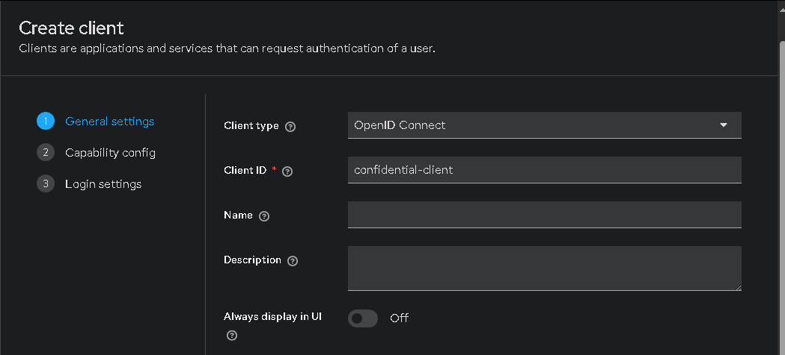
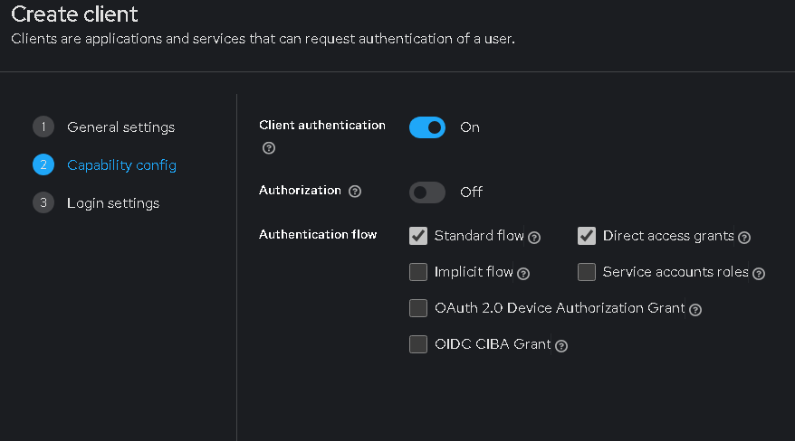
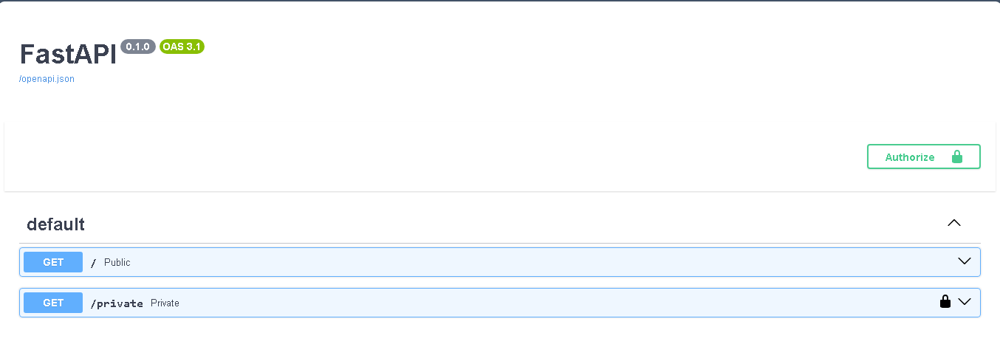
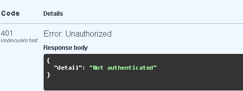
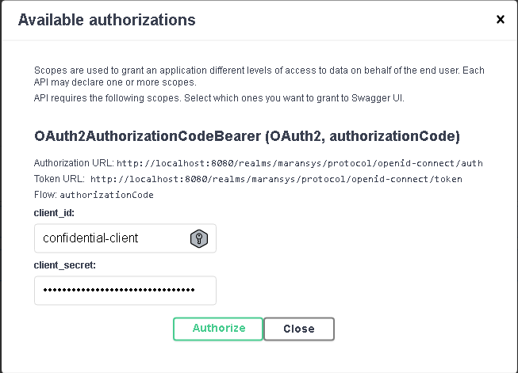
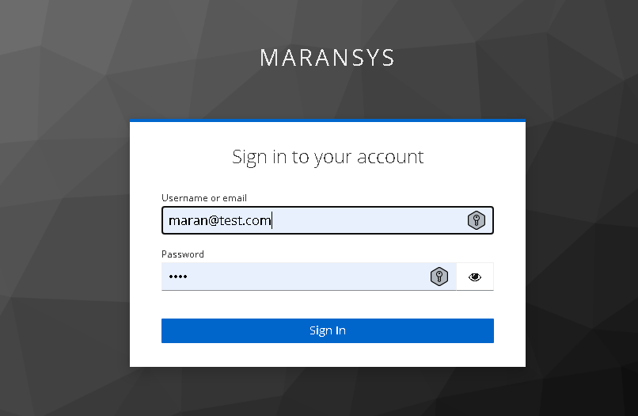
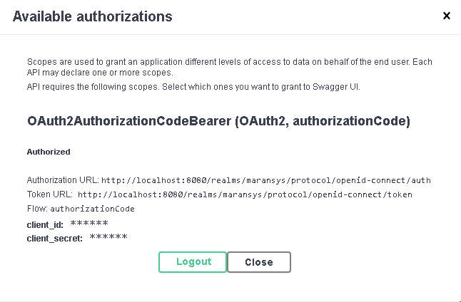
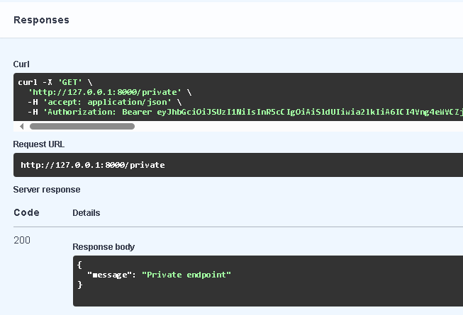

# Simple Fastapi endpoint integration with Keycloak

- Install the Keycloak server. You can use Docker, here I have setup locally.
- Start the Keycloak server using the command
  ```console
  start the Keycloak in development mode. For Production , just  use start
  > kc.bat start-dev
  ```
  - Setup the new Realm. Here I have set it as Maransys
  - Create the client and enable client authentication
  

  
  - Add the below redirect urls
    http://127.0.0.1:8000/docs/oauth2-redirect
    http://127.0.0.1:8000/
  - For handle CORS, add the below Web Origins
    http://127.0.0.1:8000

## FastAPI endpoints


### Before Authentication



### Authorize







### Accessing private endpoint
