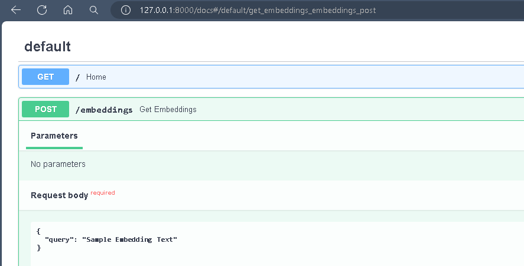
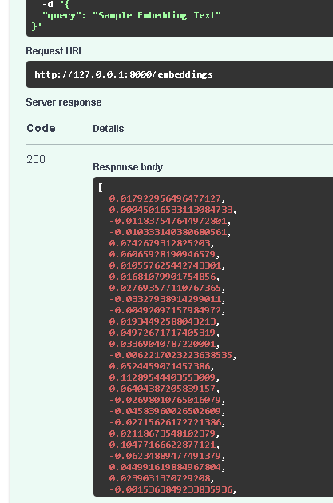

# installed packages
- fastapi : Web framework for building APIs with python
- uvicorn : ASGI server to run FastAPI applications.
- sentence-transformers : Library for computing sentence embedding using pre-trained models
  


# Run the FastAPI application
Start the  FastAPI application by running the following command in the terminal where main.py is located.
```bash
    uvicorn main:app --reload
```
 - -reload enables auto-reloading of the server when code changes.

# Test the Endpoint
- You can connect to the Swagger documentation of the Fastapi using
- http://127.0.0.1:8000/docs
  ```json
  {
    "query":"Your query text here"
  }
  ```
## Sample Input and output



