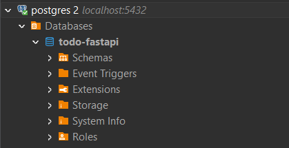
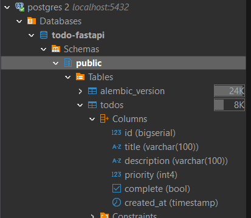
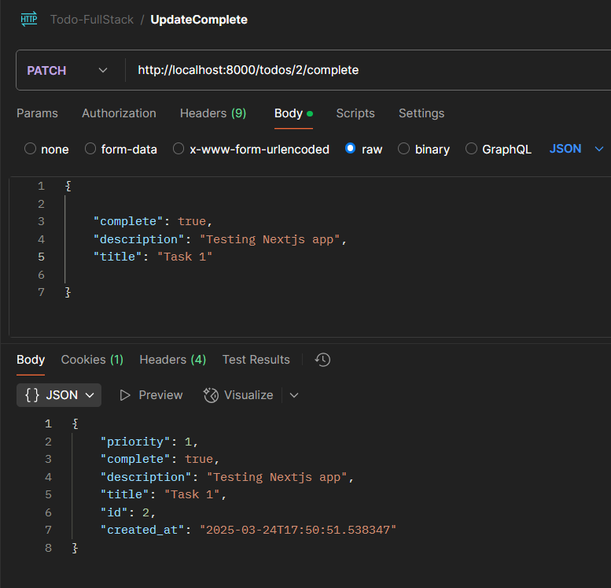
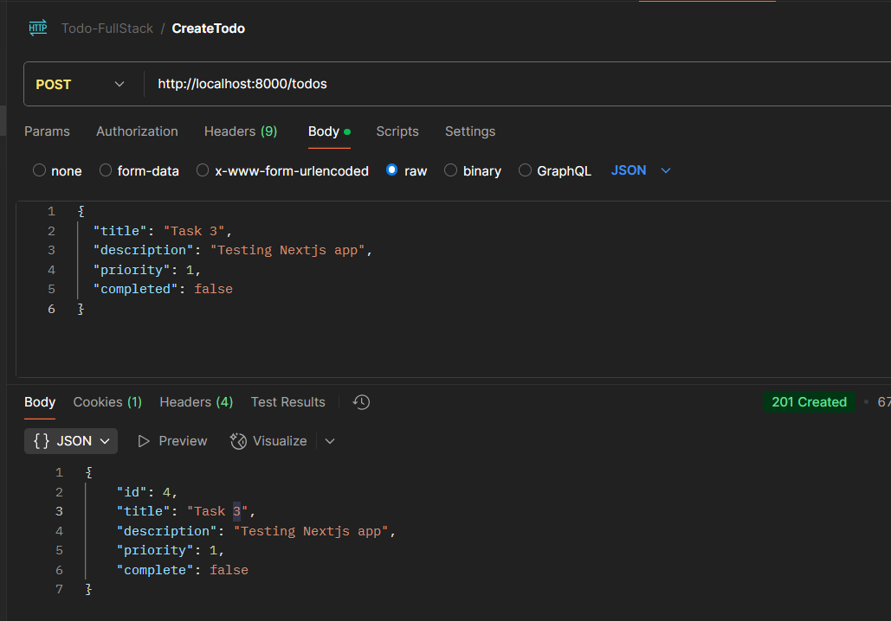

Create Virtual Environment

Create docker-compose file for Postgres

Create Database 
```bash
set PGPASSWORD=postgres
createdb -U postgres -h localhost -p 5432 todo-fastapi
```



alembic init alembic

alembic revision -m "create todos table"

alembic upgrade head






