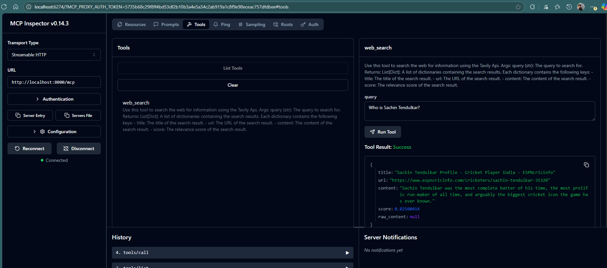
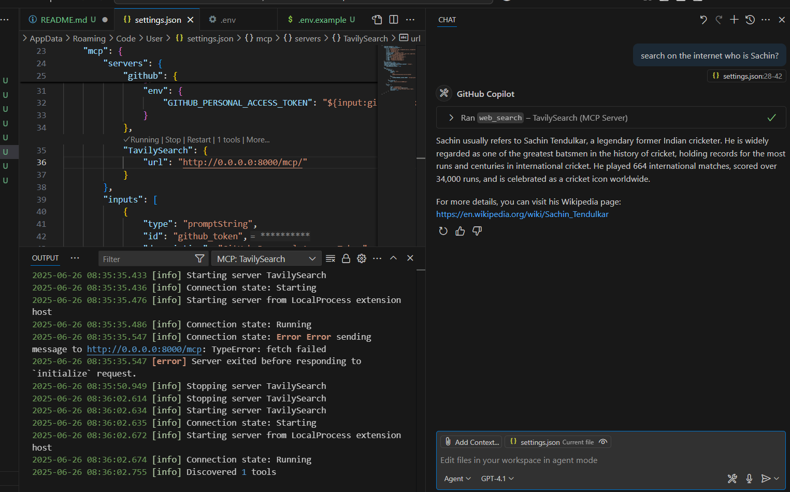
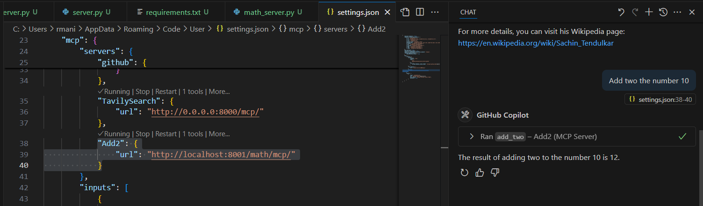

# MCP Streamable HTTP Servers

A collection of Model Context Protocol (MCP) servers built with FastMCP and FastAPI, demonstrating streamable HTTP transport for AI tool integration.

## Features

- **Web Search Server**: Search the web using Tavily API
- **Echo Server**: Simple message echoing functionality
- **Math Server**: Basic mathematical operations
- **Streamable HTTP Transport**: Efficient streaming communication
- **VS Code Copilot Integration**: Direct integration with GitHub Copilot

## Project Structure

```
├── fastapi/
│   ├── server.py       # Main FastAPI application
│   ├── echo_server.py  # Echo MCP server
│   └── math_server.py  # Math MCP server
├── main.py             # Web search MCP server
├── pyproject.toml      # Project configuration
├── requirements.txt    # Python dependencies
└── .env.example        # Environment variables template
```

## Prerequisites

- Python 3.13+
- [uv](https://docs.astral.sh/uv/) package manager
- Tavily API key (for web search functionality)

## Setup

1. **Clone the repository**
   ```bash
   git clone <repository-url>
   cd MCP-StreamableHttp
   ```

2. **Install dependencies**
   ```bash
   uv add -r requirements.txt
   ```

3. **Configure environment variables**
   ```bash
   cp .env.example .env
   # Edit .env and add your TAVILY_API_KEY
   ```

## Running the Servers

### Web Search Server (Tavily)
```bash
uv run main.py
```
Runs on `http://localhost:8000`

### Combined FastAPI Servers (Echo + Math)
```bash
uv run fastapi/server.py
```
Runs on `http://localhost:8001` with:
- Echo server: `/echo`
- Math server: `/math`

## Testing with MCP Inspector

1. **Install MCP Inspector**
   ```bash
   npx @modelcontextprotocol/inspector
   ```

2. **Connect to servers**
   - Web Search: `http://localhost:8000`
   - Echo/Math: `http://localhost:8001/echo` or `http://localhost:8001/math`

## VS Code Copilot Integration

The servers can be integrated with GitHub Copilot in VS Code for enhanced AI assistance.


*MCP Inspector interface*


*VS Code Copilot integration*


*Connecting from VS Code Copilot Agent*

## Available Tools

### Web Search Server
- `web_search(query: str)`: Search the web using Tavily API

### Echo Server
- `echo(message: str)`: Echo back the provided message

### Math Server
- `add_two(n: int)`: Add 2 to the given number

## Dependencies

- `fastapi>=0.115.14`: Web framework
- `mcp>=1.9.4`: Model Context Protocol implementation
- `tavily-python>=0.7.8`: Tavily search API client
- `python-dotenv`: Environment variable management
- `uvicorn`: ASGI server

## License

This project is open source and available under the MIT License.