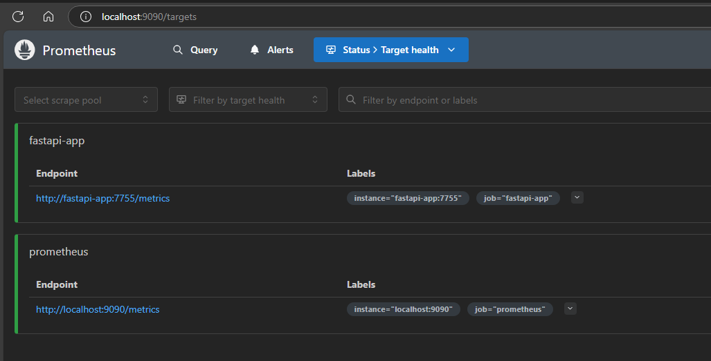
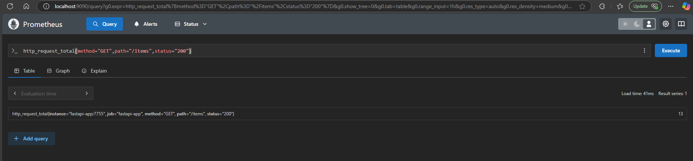
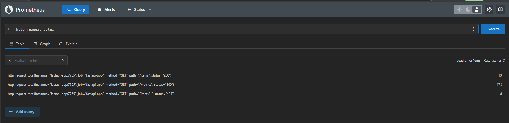
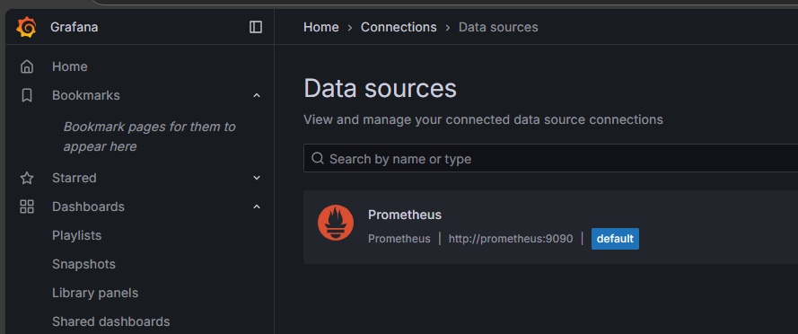
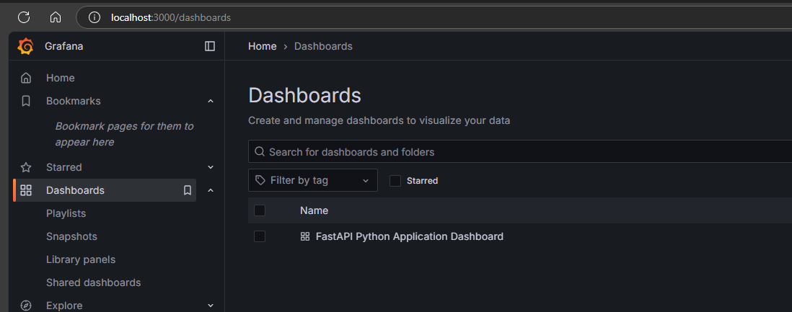
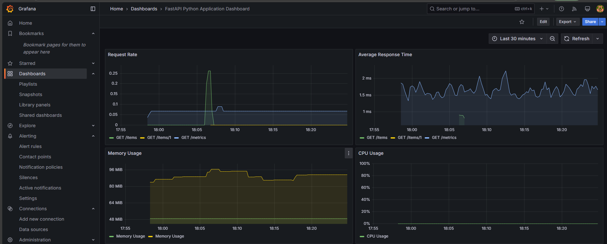

# FastAPI Observability Stack: Prometheus & Grafana with Auto-provisioning

## Introduction
A comprehensive monitoring solution for FastAPI applications featuring automated setup of Prometheus metrics collection and pre-configured Grafana dashboards. This project demonstrates how to implement production-ready monitoring with zero manual configuration.

## Key Features
- Automated Grafana dashboard provisioning
- Pre-configured Prometheus data source
- FastAPI metrics instrumentation
- Container-based deployment
- Zero manual configuration needed
- FastAPI image from docker-hub

## Overview

The project consists of the following components:
- **FastAPI** application with built-in metrics endpoint (Refer:)
- **Prometheus** for collecting and storing metrics
- **Grafana** for metrics visualization and dashboarding

## Prerequisites

- Docker
- Docker Compose

## Quick Start

1. Clone the repository:

```bash
git clone <repository-url>
cd <project-directory>

2. Start the services:

```bash
docker-compose up -d
```

3. Access the services:

 - FastAPI application: http://localhost:7755

FastAPI Swagger docs: http://localhost:7755/docs

Prometheus: http://localhost:9090

Grafana: http://localhost:3000 (default credentials: admin/admin)

## Docker-Compose Commands
```bash
# Up the services in the docker Compose file
> docker-compose up -d

# down all the services in the docker componse file
> docker-compose down

# If some changes made tp docker-compose.yml and 
# want to apply those changes to the already running services without using down and then up
> docker-compose up -d

# This will recreate only the containers that have changes while leaving the unchanged containers running.

# To restart specific service after making changes.
> docker-compose restart <service-name>

# To force recreation of a specific service:
> docker-compose up -d --force-recreate <service-name>

```

## Auto Configuration of Prometheus datasource in grafana while provisioning
- Under the grafana folder, create a folder named datasources
- create a file named datasource.yml
- Place the below contents

```yaml
apiVersion: 1

datasources:
  - name: Prometheus
    type: prometheus
    access: proxy
    url: http://prometheus:9090
    isDefault: true
```
- update the docker-compose.yml to include the provisiong

```yaml
services:
  grafana:
    image: grafana/grafana:latest
    ports:
      - "3000:3000"
    environment:
      - GF_SECURITY_ADMIN_PASSWORD=admin
      - GF_SECURITY_ADMIN_USER=admin
    volumes:
      - grafana-data:/var/lib/grafana
      - ./grafana/datasource.yml:/etc/grafana/provisioning/datasources/datasource.yml
```
- Here is the Prometheus Targets which starts scrapping from metrics endpoint in the fastapi application.




- Testing some metrics query.





# Auto-provision a dashboard when Grafana starts up.

- Follow a specific directory strucutre and update the docker-compose configuration.

Folder Structure:
```
grafana/
├── dashboards/
│   ├── dashboard.yml
│   └── grafana-dashboard.json
└── datasources/
    └── datasource.yml
```
- In dashboard.yml file place the below contents.

```yaml
apiVersion: 1

providers:
  - name: 'Default'
    orgId: 1
    folder: ''
    folderUid: ''
    type: file
    disableDeletion: false
    updateIntervalSeconds: 10
    allowUiUpdates: true
    options:
      path: /etc/grafana/provisioning/dashboards
      foldersFromFilesStructure: true

```

- update the docker-compose file to include the dashboard provisioning.

```yaml
services:
  grafana:
    image: grafana/grafana:latest
    ports:
      - "3000:3000"
    environment:
      - GF_SECURITY_ADMIN_PASSWORD=admin
      - GF_SECURITY_ADMIN_USER=admin
    volumes:
      - ./grafana/dashboards/dashboard.yml:/etc/grafana/provisioning/dashboards/dashboard.yml
      - ./grafana/dashboards/grafana-dashboard.json:/etc/grafana/provisioning/dashboards/grafana-dashboard.json
      - ./grafana/datasources/datasource.yml:/etc/grafana/provisioning/datasources/datasource.yml
      - grafana-data:/var/lib/grafana

```
- Here is the auto provisioned Prometheus datasource information.



- Here is the auto provisioned grafana dashboard for the fastapi project.



- Here is the dashboard metrics view of the fastapi project.

