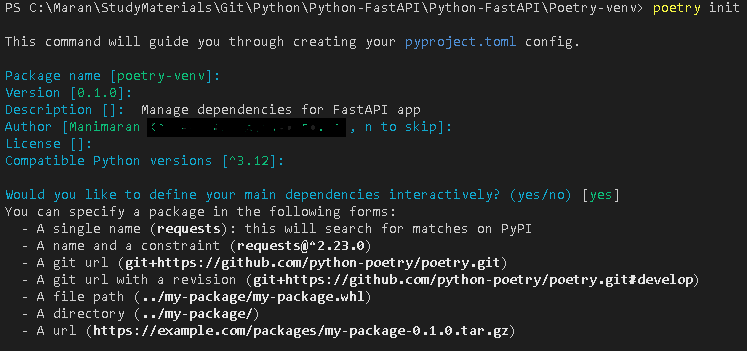
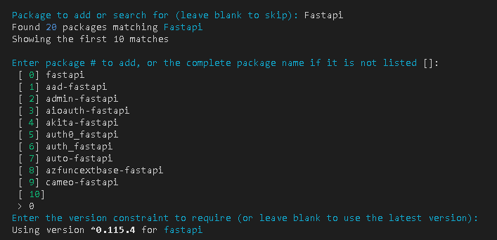
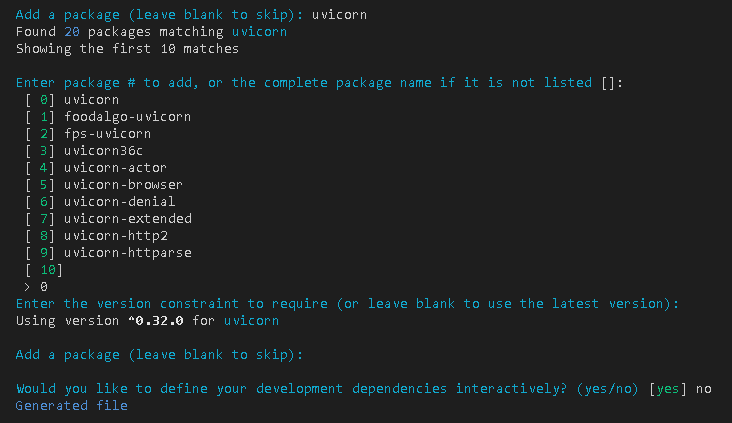
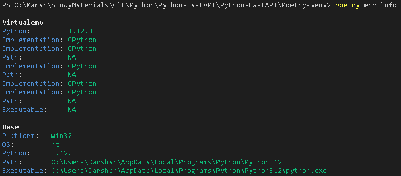
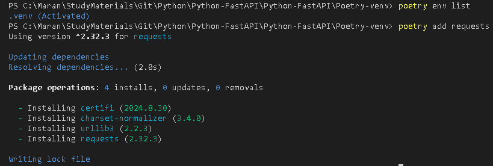
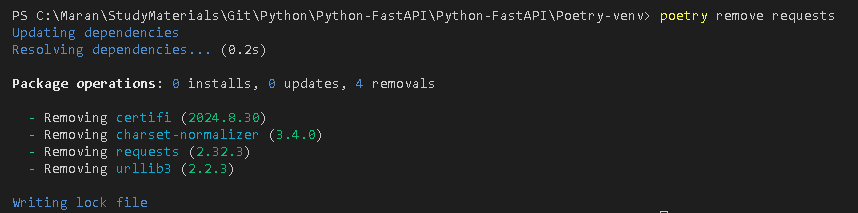

## Using Poetry to manage Virtual Environment and packages

- Install the Poetry using the command
  ```bash 
  pip install poetry
  ```
- Initialize the Poetry
  ```bash
  poetry init
  ```






- Create Virtual Environment and Install the dependenicies
  ```bash
  poetry install 
  ```` 

- Create Virtual Environment as part of project folder instead of /users/... folder
  ```bash
  > poetry config virtualenvs.in-project true
  > poetry install
  ```

- Get the virtual environment details
  ```bash
     > poetry env info
  ```



- Get the Path to the Virtual environment
  ```bash
  > poetry env info -p
  ```
- Activte the Virtual Environment
  ```bash
  > poetry shell
  ```
- Install some more additional packages
  ```bash
   > poetry add requests
  ```
  

- uninstall/remove some package added earlier
  ```bash
  > poetry remove requests
  ```


- Exit out of virtual environment
  ```bash
  > exit
  ```
